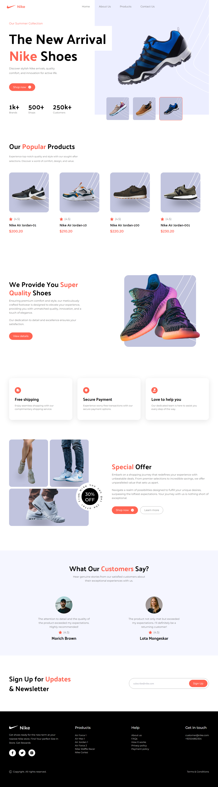
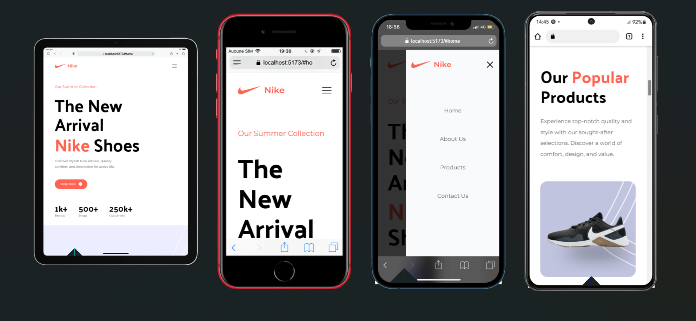

# Portfolio Project - Nike Shop

## Table of contents

- [Portfolio Project - Nike Shop](#portfolio-project---nike-shop)
  - [Table of contents](#table-of-contents)
  - [Overview](#overview)
    - [The challenge](#the-challenge)
    - [Screenshot](#screenshot)
    - [Links](#links)
    - [Built with](#built-with)
    - [Continued development](#continued-development)
  - [Author](#author)

## Overview

### The challenge

Users should be able to:

- View the optimal layout for the site depending on their device's screen size
- See hover states for all interactive elements on the page
- Interact with Hero Shoe Card

### Screenshot

### Links

- Solution URL: [Repo](https://github.com/Gandah/Nike-ecommerce-app.git)
- Live Site URL: [Visit Site](https://nike-ecommerce-app-omega.vercel.app/)

### Built with

- Semantic HTML5 markup
- Flexbox
- CSS Grid
- Mobile-first workflow
- [React](https://reactjs.org/) - JS library
- [Tailwind Css](https://tailwindcss.com/) - Css framework
- framer-motion
- React icons

### Continued development

- Back to top scroll feature
- Mobile menu navigation
- Page Animations

## Author

- Website - [MyLinkedIn](https://www.linkedin.com/in/gandahkelvin)
- Frontend Mentor - [@Gandah](https://www.frontendmentor.io/profile/Gandah)
- Twitter - [@mr_g4nderson](https://twitter.com/mr_g4nderson?t=A5NobjZab2sVEdh3Zq9s0A&s=09)
